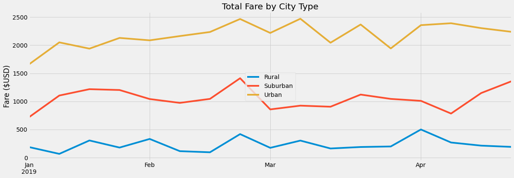

# Pyber_Analysis

## Overview of the Analysis

The analysis will involve creating a summary of the ride sharing data by city type from PyBer. Additionally, the analysis will inculde a multi line graph that will show the total weekly fares by city type. This data will summarize how the data differs be city type which can be used by decision makers at PyBer.

## Outcomes of the Analysis

###### DataFrame of Ride Data By City Type

#### Total Rides, Drivers, and Fares

Each city type ranked the same in terms of total rides, drivers, and fares. The urban cities consistently had the highest in each category followed by the suburban cities and then the rural.

#### Average Fare per Ride and Driver

When looking at the average fares per ride and driver, it was actually the opposite as the totals above. THe urban cities had the lowest average fare per ride and driver while the rural cities had the highest.

#### Weekly Fares by City Type

The multi-line chart below shows the fares over time for each city type.

## Summary

It is clear that there is a disparity of average fare per ride and driver between the 3 city types. It seems that with a decrease in total drivers and rides means an increase in average fares. Below will show a more in depth explanation of the findings.

#### Average Fare Per Driver

When looking at average fare per driver, it is important to consider that the amount of total drivers might not be the amount of total active drivers. For example, in urban cities there were 2405 drivers and only 1625 rides given. This means only 2/3 of drivers were active in the time period shown in the dataset assuming each driver only gave one ride.

From this data, you can see that as a driver in a rural city you can make more money than one in an urban city. The average fare per driver was $15 more than suburban cities and almost $40 more than urban cities. The total drivers can be representative of the total workforce wanting to use ride sharing as a way to make some extra income. So, the point that this data makes is that the average driver in a rural city will make 3.5 times more money due to demand in rides per driver than in urban cities within the same time period.

#### Average Fare Per Ride

The average fare per ride data can show how much customers using PyBer would pay for a ride. Again, the average fare is the greatest in the rural cities and the lowest in the urban cities. The average fare in rural cities is $4 more per ride than suburban cities and $10 more per ride than urban cities.

This disparity could be due to less supply of drivers making the average fare per ride higher, or it could be due to not as many people in urban cities needing rides from PyBer possibly due to public transportation alternatives. Regardless, customers of PyBer can expect to pay more for a ride if they are living in a rural city than if they are living in an urban or suburban city.

#### Total Fares Over Time

The multi-line chart in the outcomes section above shows the rates over time for each city type. From this graph, it shows us what we already know that the total fares is the highest in urban cities and the lowest in rural cities. Additionally, the total fares in each city type does not seem to increase or decrease with the other city types consistently. The only exception seems to be in late February when the total fares spiked in all 3 city types.
